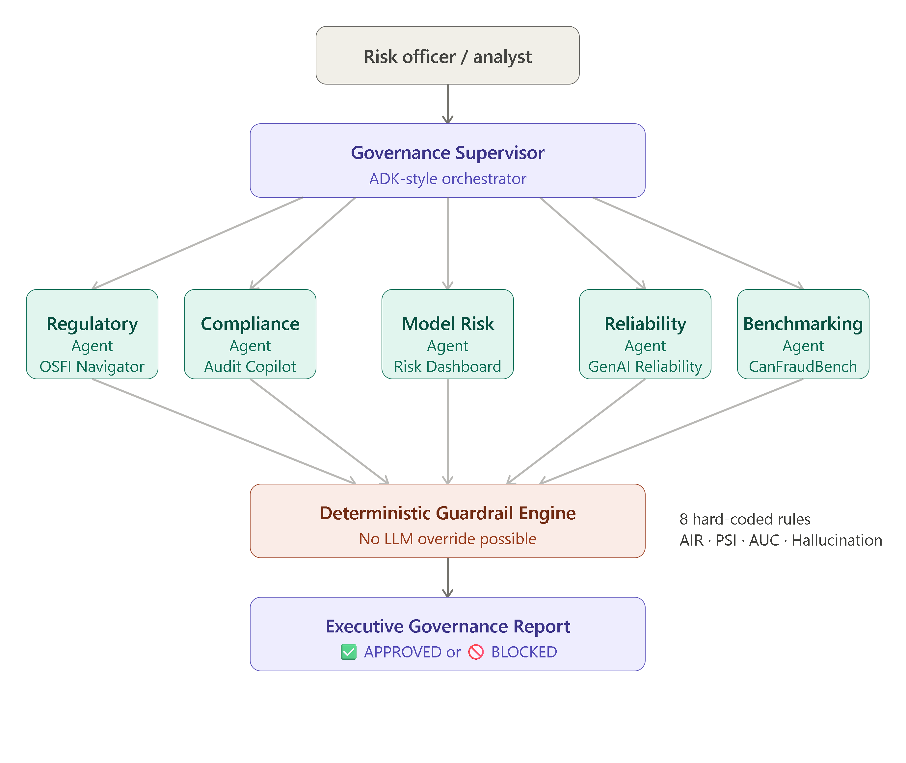

# Enterprise AI Governance Control Tower
### Multi-Agent Model Risk Orchestration with Google ADK

> **"A fraud detection model achieving AUC 0.969 is BLOCKED from production due to fairness violations. Accuracy alone is not governance."**

[](https://kaggle.com/competitions/vibecoding-agents-capstone-project)
[](https://kaggle.com/competitions/5-day-ai-agents-intensive-vibecoding-course-with-google)
[](https://www.osfi-bsif.gc.ca/en/guidance/guidance-library/enterprise-wide-model-risk-management-guidelines-federally-regulated-financial-institutions)

---

## Architecture



---

## The Problem

Canadian financial institutions face an inflection point. OSFI Guideline E-23 establishes model risk management expectations for federally regulated institutions — and most banks are still operationalizing what this means in practice.

The trap every bank faces:

- A fraud detection model achieves **AUC 0.969** — excellent by any accuracy standard
- It sails through technical review and gets deployed to production
- Six months later, OSFI examines the model and finds **AIR 0.59** (fairness failure) and **PSI 0.25** (significant drift)
- The bank faces remediation requirements and enhanced supervision

**This is not hypothetical.** It is the exact scenario demonstrated in [CanFraudBench](https://github.com/CrillyPienaah/canfraudbench), published June 2026.

The problem is not the model. The problem is the **governance infrastructure** around the model.

---

## The Solution

The **Enterprise AI Governance Control Tower** is a multi-agent system that coordinates five specialized AI governance agents to evaluate whether a model is production-ready under enterprise governance expectations aligned with OSFI E-23.

```
                    Executive User / Risk Officer
                               │
                               ▼
                  ┌─────────────────────────┐
                  │   Governance Supervisor  │  ← ADK-style orchestrator
                  └────────────┬────────────┘
                               │
      ┌──────────┬─────────────┼─────────────┬──────────┐
      ▼          ▼             ▼             ▼          ▼
  OSFI        Audit        Model         GenAI      CanFraud
 Navigator   Copilot       Risk       Reliability    Bench
  Agent       Agent        Agent        Agent        Agent
      │          │             │             │          │
      └──────────┴─────────────┴─────────────┴──────────┘
                               │
                               ▼
                  ┌─────────────────────────┐
                  │  Deterministic Guardrail │  ← No LLM override possible
                  │       Engine            │
                  └────────────┬────────────┘
                               │
                               ▼
                  ┌─────────────────────────┐
                  │  Executive Report        │
                  │  Generator              │
                  └─────────────────────────┘
```

---

## Live Systems

All five agents connect to real deployed systems:

| Agent | Live System | Description |
|---|---|---|
| Regulatory Intelligence | [osfi-navigator-frontend.vercel.app](https://osfi-navigator-frontend.vercel.app) | OSFI E-23 regulatory intelligence with inline citation chips |
| Compliance Assessment | [osfi-audit-copilot-frontend.vercel.app](https://osfi-audit-copilot-frontend.vercel.app) | Compliance gap assessment against OSFI sections |
| Model Risk Monitoring | [model-risk-dashboard.vercel.app](https://model-risk-dashboard.vercel.app) | PSI drift detection, AUC tracking, fairness metrics |
| Reliability Evaluation | [genai-reliability-framework.vercel.app](https://genai-reliability-framework.vercel.app) | Hallucination risk, grounding score, citation coverage |
| Benchmarking | [github.com/CrillyPienaah/canfraudbench](https://github.com/CrillyPienaah/canfraudbench) | Published Canadian fraud detection fairness benchmark |

---

## Course Concepts Demonstrated

| Concept | Implementation |
|---|---|
| **Multi-Agent System (ADK)** | `GovernanceSupervisor` orchestrating 5 specialized agents in sequence |
| **MCP Server** | Five MCP-style tools, one per live system, standardized input/output schemas |
| **Security Features** | Deterministic guardrail engine — 8 hard-coded rules, no LLM override possible |
| **Deployability** | Five live systems deployed on Railway + Vercel, orchestration layer demo-ready |
| **Agent Skills** | Each agent is a narrow specialist: regulatory, compliance, risk, reliability, benchmarking |
| **Spec-Driven Development** | Governance thresholds defined as specs first; agents serve the rules |

---

## The Key Finding

```
Model: CanFraudBench Reference Fraud Detector

Performance:  AUC = 0.969  ✅  (Excellent)
Fairness:     AIR = 0.59   🚫  (Below 0.80 minimum — CRITICAL FAILURE)
Drift:        PSI = 0.25   🚫  (Above 0.20 threshold — CRITICAL FAILURE)

GOVERNANCE STATUS: 🚫 BLOCKED

"Accuracy alone is insufficient for governance in regulated industries."
```

Compare with a well-governed credit model (AUC 0.847, AIR 0.91, PSI 0.08) that receives **✅ APPROVED** status across all 8 guardrail rules.

---

## Deterministic Guardrails

Rules are evaluated in Python code — not in prompts. No LLM can override them.

```python
GOVERNANCE_THRESHOLDS = {
    "air_min": 0.80,        # Fairness — 4/5ths rule
    "psi_max": 0.20,        # Drift — significant threshold
    "psi_warning": 0.10,    # Drift — moderate warning
    "hallucination_max": 0.10,
    "auc_min": 0.70,
    "ece_max": 0.05,
    "tpr_gap_max": 0.10,
}
```

From the Day 5 whitepaper: *"Hard-coding constraints into a system prompt is brittle. To build production-grade platforms, external, tamper-proof governance is required."*

Every guardrail in this system is a Python `if` statement. `llm_override_possible: False`.

---

## Project Structure

```
governance-control-tower/
├── governance_control_tower.py   # Full orchestrator — run this for the demo
├── kaggle_capstone_notebook.ipynb  # Kaggle submission notebook
├── README.md                     # This file
└── requirements.txt              # Dependencies
```

---

## Setup and Running

### Prerequisites
- Python 3.11+
- No API keys required for the demo (all tools use structured mock responses)

### Install
```bash
git clone https://github.com/CrillyPienaah/governance-control-tower
cd governance-control-tower
pip install -r requirements.txt
```

### Run the Demo
```bash
python governance_control_tower.py
```

Expected output:
```
══════════════════════════════════════════════════════════════════════
  ENTERPRISE AI GOVERNANCE CONTROL TOWER
  Powered by Google ADK | OSFI E-23 Compliance
══════════════════════════════════════════════════════════════════════

SCENARIO: TD Credit Risk Scoring Model v3
  GOVERNANCE STATUS: ✅ APPROVED
  8/8 guardrails passed

SCENARIO: CanFraudBench Reference Model — AUC 0.969, AIR 0.59
  GOVERNANCE STATUS: 🚫 BLOCKED
  CRITICAL: FAIRNESS_AIR — AIR 0.59 below minimum 0.80
  CRITICAL: DRIFT_PSI_CRITICAL — PSI 0.25 indicates significant shift
```

### Connect to Live Systems (Production Mode)
Each MCP tool includes a comment with the live endpoint URL. To connect:
1. Replace the mock `return` statements with `httpx.post(LIVE_URL, json=payload)`
2. Set environment variables for any required API keys
3. The orchestrator architecture remains identical

---

## Architecture Decisions

### Why Multi-Agent Rather Than a Single Agent?
A single monolithic agent told to "evaluate this model for OSFI compliance" will hallucinate, miss edge cases, and produce inconsistent outputs. By decomposing governance evaluation into five specialists — each with a narrow, well-defined responsibility — we achieve separation of concerns, deterministic guardrails, auditability, and extensibility.

### Why Deterministic Rules Over Prompt-Based Guardrails?
From the Day 4 whitepaper: LLMs can be "convinced" to bypass rules via prompt injection. A governance system that can be argued out of its rules is not a governance system. Every threshold in this project is a Python constant. Every rule is an `if` statement. No model call is involved in the final determination.

### Why Five Separate Live Systems?
The five systems were built independently over six months as part of a Blue Ocean career strategy targeting Canadian financial institutions ahead of OSFI E-23 enforcement. The capstone orchestration layer is the natural culmination — unifying them into a single governance pipeline rather than five isolated tools.

---

## Regulatory Context

**OSFI Guideline E-23** establishes enterprise-wide model risk management expectations for federally regulated financial institutions in Canada. Key areas addressed by this project:

- Section 3: Governance frameworks and accountability
- Section 4: Model development and validation standards
- Section 5: Ongoing monitoring (PSI, CSI, performance tracking)
- Section 6: Fairness and bias assessment
- Section 7: Reliability for generative AI components
- Section 8: Audit trail and documentation requirements

---

## Author

**Christopher Crilly Pienaah**  
MPS Analytics, Northeastern University (May 2026)  
[chris-pienaah-portfolio.vercel.app](https://chris-pienaah-portfolio.vercel.app)  
[github.com/CrillyPienaah](https://github.com/CrillyPienaah)  
[huggingface.co/CrillyPienaah](https://huggingface.co/CrillyPienaah)

---

*Kaggle Capstone — AI Agents: Intensive Vibe Coding Course with Google | June 2026*
